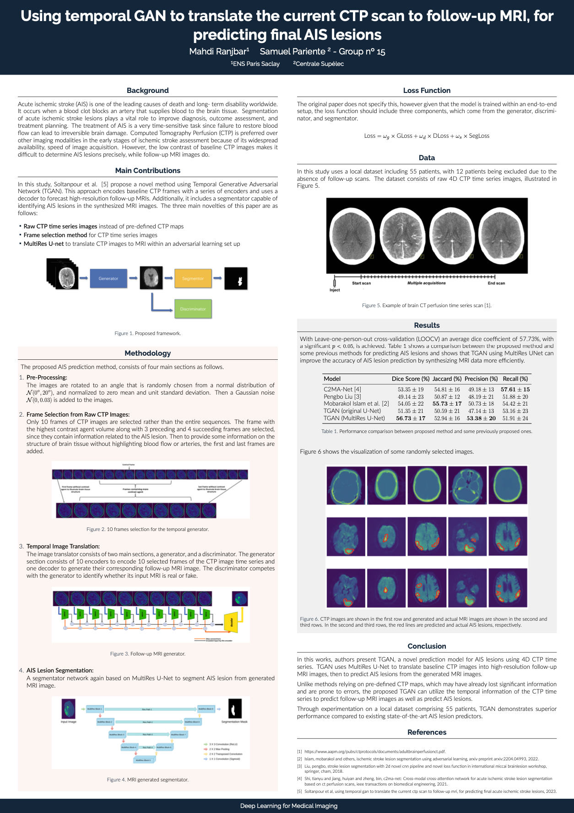

# Using temporal GAN to translate the current CTP scan to follow-up MRI, for predicting final AIS lesions

## Reference
Mohsen Soltanpour et al. “Using temporal GAN to translate the current CTP scan to follow-up
MRI, for predicting final acute ischemic stroke lesions”. In: Medical Imaging 2023: Computer-Aided
Diagnosis. Ed. by Khan M. Iftekharuddin and Weijie Chen. Vol. 12465. International Society for Optics
and Photonics. SPIE, 2023, p. 124653D. doi: 10.1117/12.2654069. url: https://doi.org/10.
1117/12.2654069.